

<h1 style="color:#fff">Carwash Mobile App - 🚗🚿</h1>

 
<i>
   Backend (Node js) and mobile (Flutter) code are in a <a href="https://github.com/bhlshrf/carwash">private repo</a> if you wish to see them please contact me.
</i>
    

- Splash screen and Select service provider from Map  Pages

    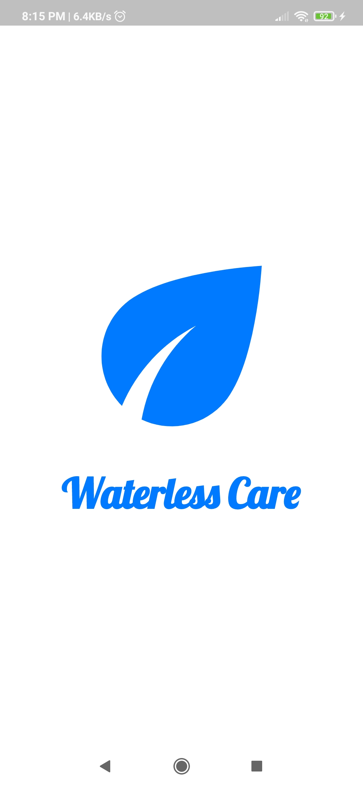
    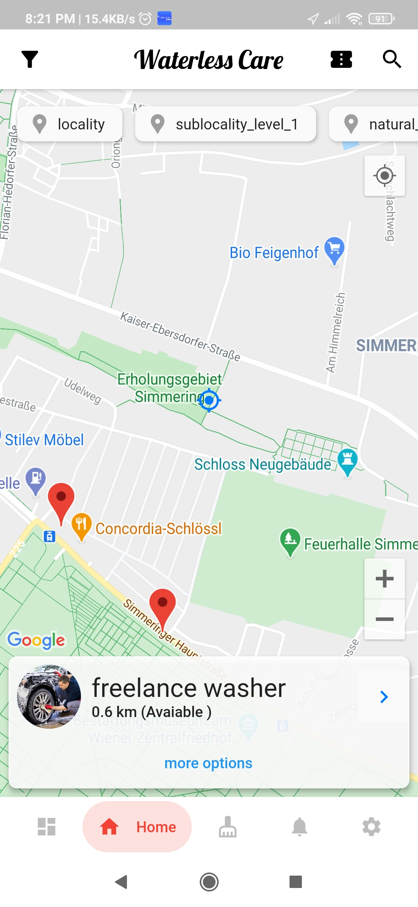
    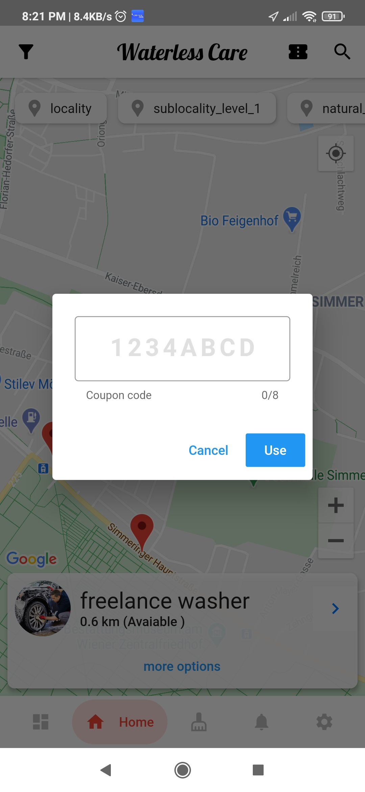

- Pages for select cars, services and dateTime

    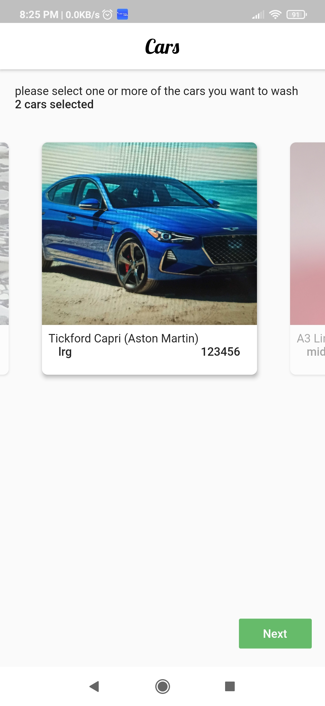
    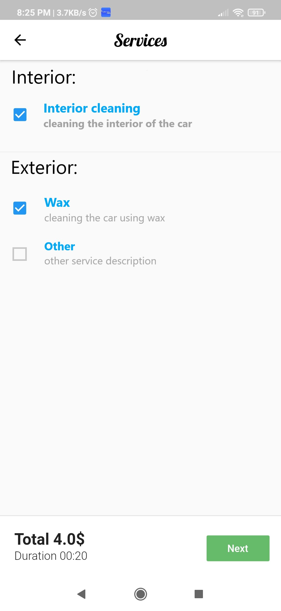
    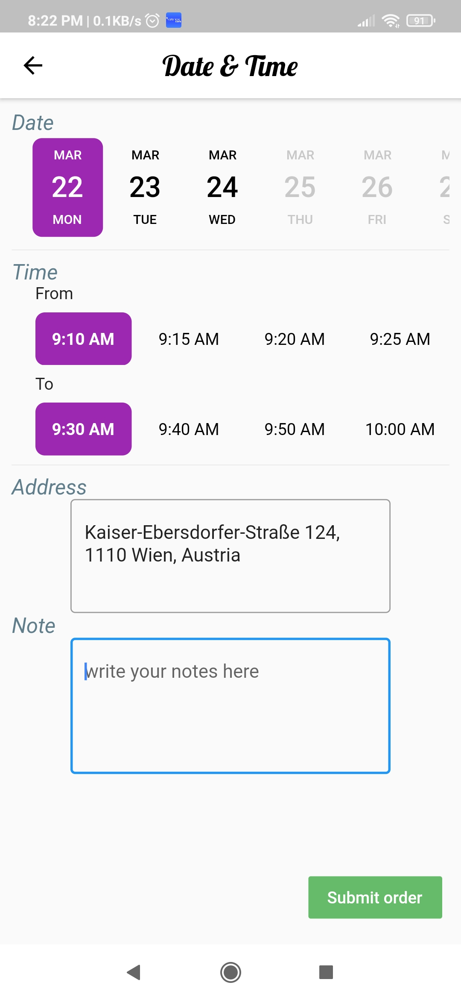

- Payment and Cards Page

    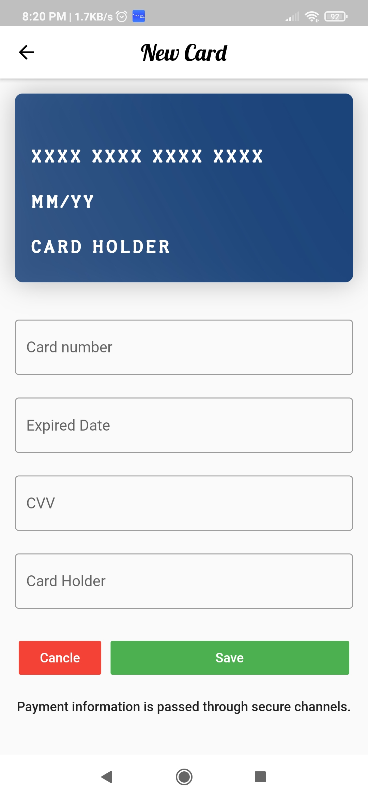

- Request details pages

    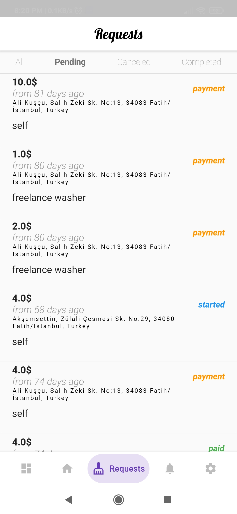
    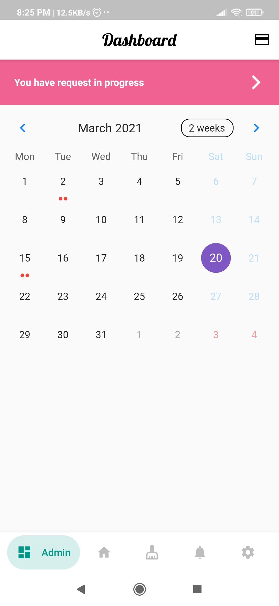
    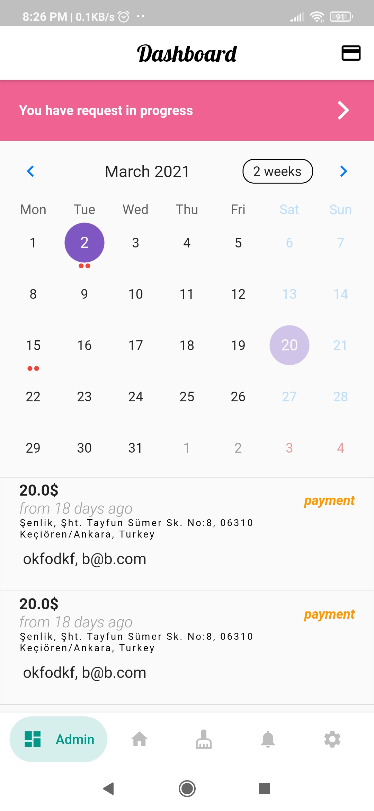
    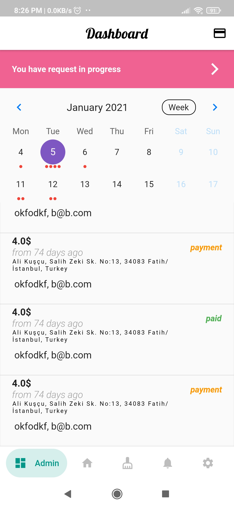
    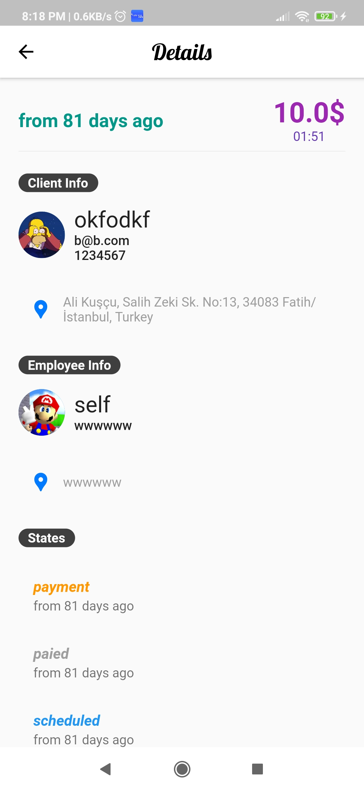
    

- News, Chat and Balance pages

    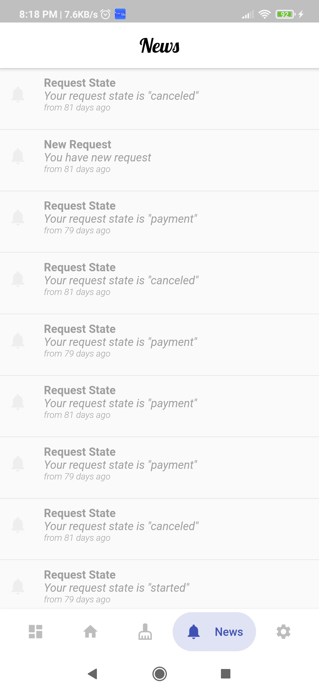
    
    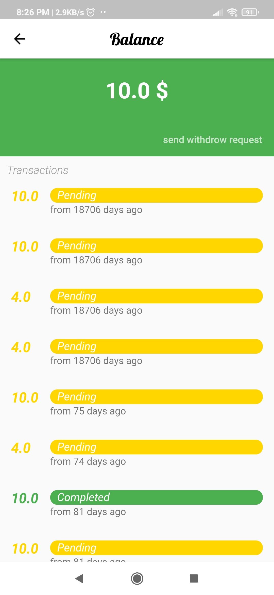
    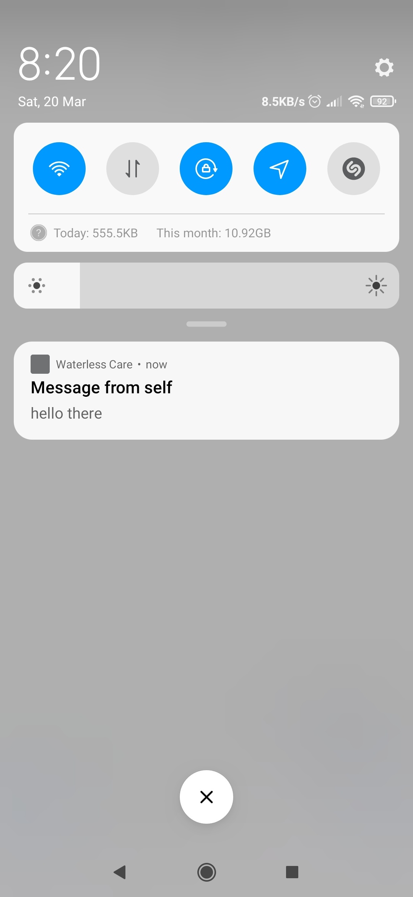

